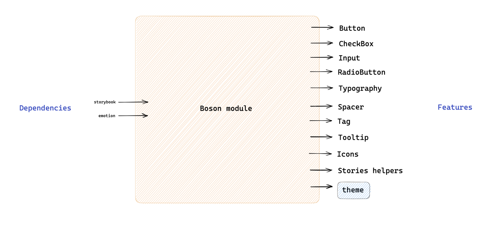

# Boson

## Overview



## Requirements

- [TypeScript](https://github.com/bamlab/react-native-enablers/blob/master/docs/gestures/typescript/typescript.md)
- [React Native Testing Library](https://github.com/bamlab/react-native-enablers/blob/master/docs/gestures/test/testing-library-react-native/testing-library-react-native.md)
- [Custom snapshots](https://github.com/bamlab/react-native-enablers/blob/master/docs/gestures/test/custom-snapshots.md)

## Usage

1. Clone the repo in a temporary folder.

   ```bash
   git clone git@github.com:bamlab/react-native-warehouse.git $TMPDIR/react-native-warehouse
   ```

1. Copy past `modules/boson` folder in your project, for example `src/shared/view`.

   ```bash
   mkdir -p @src/shared/view
   rsync -av --exclude={'README.md','boson.png'} $TMPDIR/react-native-warehouse/src/modules/boson/ @src/shared/view
   ```

1. Install dependencies:

   ```bash
   yarn add @emotion/react @emotion/native expo-font react-native-svg
   # For bare React Native
   npx pod-install
   ```

1. If you need the Switch component, install Reanimated:

   ```bash
   yarn add react-native-reanimated
   # For bare React Native
   npx pod-install
   ```

   ```js
   // babel.config.js
   {
     plugins: [
      'react-native-reanimated/plugin',
     ],
   }
   ```

1. Resolve [the import aliases](https://github.com/bamlab/react-native-enablers/blob/master/docs/gestures/imports/options/path_aliases.md):

   - `"@src/shared/view"` → `"@src/shared/view"`
   - `"@src/testing"` → `"./src/testing"`

   If you prefer standard `#shared/view` imports instead of the `@src/shared/view` alias, use:

   ```bash
   grep -rl \@src/shared/view @src/shared/view | xargs sed -i '' -e 's/@src/shared/view/#shared\/view/g'
   ```

1. Provide the theme and fonts in `App.tsx`:

   ```tsx
   // App.tsx

   import { ThemeProvider } from "@emotion/react";
   import { useFonts } from "expo-font";
   import { fontFiles } from "@src/shared/view/theme/fonts";
   import { theme } from "@src/shared/view/theme/theme";

   const App = () => {
     const [fontsLoaded] = useFonts(fontFiles);
     if (!fontsLoaded) {
       return null;
     }

     return (
       <ThemeProvider theme={theme}>
         {/* ... wrap other providers ... */}
       </ThemeProvider>
     );
   };
   ```

1. Either install storybook or remove all the code related to storybook

   - `*.stories.tsx` files
   - `storybook` folder

1. Provide the theme in tests

   ```tsx
   // src/testing/render.tsx

   import { ThemeProvider } from "@emotion/react";
   import { theme } from "@src/shared/view/theme/theme";

   // ... wrap children in the custom renderer ...
   <ThemeProvider theme={theme}>{children}</ThemeProvider>;
   // ...
   ```

1. Configure boson `theme` object so that it fits your needs

1. For each component, rework them so that they perfectly fit your needs

1. ⚠️ Add your feedbacks to this [database](https://www.notion.so/m33/9c98fa88b44c4cb7b730f598add7d052?v=9f3027a5beea4d4fb09ada267eaeae05&pvs=4). It will help us to improve 🙏
